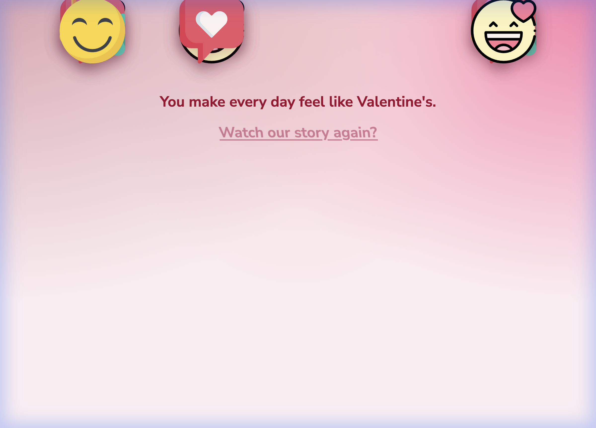

# 🌹 ValentineWish - A Romantic Experience

An immersive, premium Valentine's Day web experience designed to express deep affection through poetic content, sophisticated animations, and a heartfelt visual journey.



## ✨ Features

- **Premium Design**: A "breathing" mesh gradient background and glassmorphism UI elements.
- **Poetic Content**: Deeply romantic messages scripted to flow naturally.
- **Advanced Animations**:
    - **Continuous Floating Balloons**: A custom physics simulation for natural, swaying movement.
    - **Pulse Effects**: Subtle heartbeats for buttons and key text.
    - **Timeline Sequence**: A coordinated GSAP animation story.
- **Customizable**: Easily personalize messages and images via `customize.json`.

## 🚀 How to Deploy (GitHub Pages)

Since this project is already initialized as a Git repository, you can publish it to the world in seconds.

### 1. Create a Repository
Run this command in your terminal (requires [GitHub CLI](https://cli.github.com/)):

```bash
gh repo create ValentineWish --public --source=. --remote=origin
```

*Alternatively, create a new repository on GitHub.com and follow the "Push an existing repository" instructions.*

### 2. Push to GitHub
```bash
git branch -M main
git push -u origin main
```

### 3. Enable Live Site
1.  Go to your repository settings on GitHub.
2.  Navigate to **Pages**.
3.  Select the **main** branch as the source and click **Save**.
4.  Your live link will appear (e.g., `https://your-username.github.io/ValentineWish`).

## 🛠 Project Structure

- `index.html`: The main entry point.
- `style/style.css`: All visual styling and animations.
- `script/main.js`: The GSAP animation timeline and logic.
- `customize.json`: Configuration file for personalizing text/images.
- `img/`: Assets directory.

## 💝 Customization

Open `customize.json` to change:
- `name`: The recipient's name.
- `greetingText`: The opening message.
- `wishText`: The final wish.
- `imagePath`: The main photo.

---
*Created with ❤️ for a special Valentine.*
